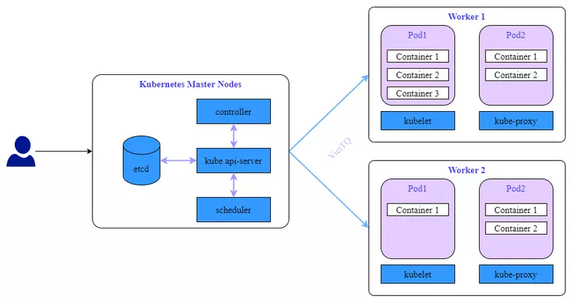

# Kubernetes là gì?

**Kubernetes** (hay viết tắt là **k8s**) là một hệ thống mã nguồn mở dùng để **triển khai, quản lý và điều phối các ứng
dụng container hóa** trên một cụm máy chủ (cluster). Với Kubernetes, bạn có thể điều chỉnh tài nguyên, tự động scale số
lượng container phục vụ cho một service, tiến hành cập nhật ứng dụng (update) hoặc thu hồi update khi cần thiết.

Các đặc điểm chính của Kubernetes gồm:

- **Quản lý container trên quy mô lớn:**  
  Kubernetes giúp quản lý hàng nghìn container cùng lúc, cho phép các tổ chức dễ dàng triển khai và vận hành các dịch vụ
  phức tạp với nhiều thành phần.

- **Tự động hóa triển khai và mở rộng (Auto-scaling):**  
  Thay vì triển khai thủ công từng container, Kubernetes tự động triển khai và mở rộng hệ thống dựa trên nhu cầu tải của
  ứng dụng.

- **Đảm bảo tính sẵn sàng cao (High Availability):**  
  Kubernetes giám sát liên tục trạng thái của các ứng dụng và có khả năng phát hiện, xử lý sự cố. Nếu một container gặp
  lỗi, hệ thống sẽ tự động khởi động lại hoặc thay thế container đó.

- **Quản lý tài nguyên linh hoạt:**  
  Kubernetes phân phối tài nguyên một cách hợp lý trên các Node, tối ưu hóa hiệu suất và giảm chi phí vận hành.

- **Di động và tính tương thích đa môi trường:**  
  Ứng dụng triển khai trên Kubernetes có thể dễ dàng di chuyển giữa các môi trường khác nhau: từ máy tính cá nhân, trung
  tâm dữ liệu doanh nghiệp đến các dịch vụ đám mây như AWS, Google Cloud, Azure.

---

# Kiến trúc của Kubernetes



Kiến trúc Kubernetes được thiết kế theo mô hình **cluster** gồm 2 phần chính: **Master Node** và **Worker Node**. Mỗi
phần có nhiệm vụ chuyên biệt và phối hợp với nhau để đảm bảo hoạt động ổn định của hệ thống.

## 1. Master Node

Master Node là trung tâm điều phối và quản lý của toàn bộ Kubernetes Cluster. Các thành phần chính trên Master Node gồm:

- **kube-apiserver:**  
  Cung cấp API dạng RESTful cho các client (như `kubectl`, dashboard) để tương tác với Kubernetes.

- **etcd:**  
  Cơ sở dữ liệu phân tán lưu trữ toàn bộ cấu hình và trạng thái của cluster dưới dạng key-value. Đây là nguồn dữ liệu
  quan trọng cho việc khôi phục và tái cấu trúc cluster.

- **kube-scheduler:**  
  Chịu trách nhiệm phân phối các Pod mới đến các Node dựa trên tài nguyên hiện có, yêu cầu về CPU, bộ nhớ và các hạn chế
  khác.

- **kube-controller-manager:**  
  Tập hợp các controller (như Deployment Controller, ReplicaSet Controller) giúp duy trì trạng thái mong muốn của
  cluster bằng cách tạo, cập nhật hoặc xóa các tài nguyên khi cần thiết.

- *(Tùy chọn)* **cloud-controller-manager:**  
  Được sử dụng trong môi trường đám mây để tích hợp các dịch vụ của nhà cung cấp cloud (ví dụ: quản lý LoadBalancer,
  Storage,…).

---

## 2. Worker Node

Worker Node (hay còn gọi là Node) là nơi thực thi và chạy các ứng dụng thực tế. Mỗi Node có thể chạy nhiều Pod, và các
thành phần chính trong một Worker Node bao gồm:

- **kubelet:**  
  Là agent chạy trên mỗi Node, chịu trách nhiệm giao tiếp với API Server, đảm bảo các container trong Pod chạy đúng cấu
  hình và báo cáo trạng thái Node.

- **kube-proxy:**  
  Quản lý các quy tắc mạng trên Node, giúp định tuyến và phân phối lưu lượng đến các Pod, đồng thời hỗ trợ cân bằng tải
  traffic nội bộ.

- **Container Runtime:**  
  Là môi trường chạy container. Các runtime phổ biến bao gồm Docker, containerd, CRI-O,…

---

# Công cụ dòng lệnh: kubectl

`kubectl` là công cụ dòng lệnh chính để tương tác với Kubernetes Cluster. Với `kubectl`, bạn có thể quản lý và thao tác
với tất cả các tài nguyên trong cluster như Pod, Service, Deployment,...

**Cú pháp cơ bản:**

```bash
kubectl [command] [TYPE] [NAME] [flags]
```

- **[command]:** Lệnh cần thực hiện (apply, get, delete, describe, …).
- **[TYPE]:** Loại tài nguyên (ví dụ: ns cho Namespace, po cho Pod, svc cho Service,…).
- **[NAME]:** Tên của đối tượng.
- **[flags]:** Các tham số thêm cho lệnh.

**Ví dụ:**

```bash
kubectl get pods             # Liệt kê tất cả các Pod
kubectl describe pod <name>    # Xem chi tiết một Pod
kubectl create -f <file.yaml>  # Tạo tài nguyên từ file YAML
kubectl apply -f <file.yaml>   # Áp dụng hoặc cập nhật cấu hình
kubectl delete pod <name>      # Xóa một Pod
kubectl logs <name>            # Xem log của một Pod
```

---

# File YAML trong Kubernetes

File YAML là **trọng tâm của việc định nghĩa cấu hình** cho các tài nguyên như Pod, Service, Deployment, ReplicaSet,
ConfigMap,… Việc sử dụng file YAML giúp quản lý cấu hình một cách có tổ chức, dễ đọc và dễ bảo trì.

**Cấu trúc cơ bản của file YAML:**

```yaml
apiVersion: <phiên bản API>
kind: <loại tài nguyên>
metadata:
  name: <tên tài nguyên>
  namespace: <tên namespace (tùy chọn)>
spec:
  <định nghĩa chi tiết của tài nguyên>
```

- **apiVersion:** Phiên bản API mà Kubernetes sử dụng cho tài nguyên (ví dụ: `apps/v1` cho Deployment, `v1` cho Pod,
  Service,…).
- **kind:** Loại tài nguyên (Pod, Service, Deployment, ConfigMap,…).
- **metadata:** Thông tin định danh của tài nguyên, như tên và namespace.
- **spec:** Phần cấu hình chi tiết cho tài nguyên như số lượng bản sao, cấu hình container, cài đặt mạng, …

---

