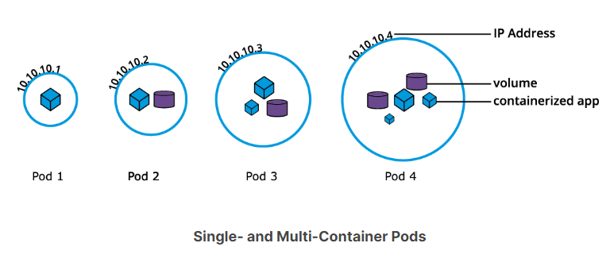
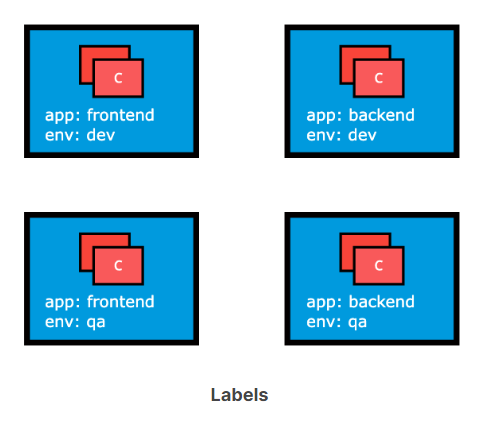
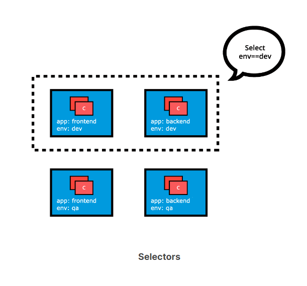

# Pods

Pod là đối tượng đơn vị công việc (workload object) nhỏ nhất của Kubernetes.  
Nó là đơn vị triển khai (deployment) trong Kubernetes, đại diện cho một phiên bản duy nhất của ứng dụng.  
Pod là một tập hợp logic của một hoặc nhiều container, bao bọc và cô lập chúng để đảm bảo rằng chúng:

- Được lên lịch (schedule) cùng nhau trên cùng một máy chủ (host) với Pod.
- Chia sẻ chung network namespace (không gian tên mạng), nghĩa là chúng dùng chung một địa chỉ IP duy nhất được gán cho
  Pod.
- Có quyền truy cập để gắn kết (mount) cùng một bộ nhớ ngoài (volume) và các phụ thuộc chung khác.



Pods bản chất là tạm thời (ephemeral) và không có khả năng tự sửa chữa (self-heal).  
Đó là lý do tại sao chúng được sử dụng với các bộ điều khiển (controller), hoặc các operator (hai khái niệm này có thể
dùng tương đương nhau), có nhiệm vụ xử lý việc sao chép (replication), chịu lỗi (fault tolerance), tự sửa chữa cho
Pods.  
Ví dụ về các bộ điều khiển điển hình: Deployment, ReplicaSet, DaemonSet, Job, v.v.

Khi một operator được sử dụng để quản lý ứng dụng, thông số cấu hình (specification) của Pod được lồng bên trong định
nghĩa của bộ điều khiển thông qua Pod Template (khuôn mẫu Pod).

Bên dưới là một ví dụ về bản khai báo định nghĩa đối tượng Pod độc lập ở định dạng YAML, không sử dụng operator:

```yaml
apiVersion: v1
kind: Pod
metadata:
  name: nginx-pod
  labels:
    run: nginx-pod
spec:
  containers:
    - name: nginx
      image: nginx:1.22.1
      ports:
        - containerPort: 80
```

apiVersion: Trường apiVersion phải được thiết lập thành v1 cho định nghĩa đối tượng Pod.

kind: Trường bắt buộc thứ hai là kind chỉ định loại đối tượng là Pod.

metadata: Trường bắt buộc thứ ba metadata chứa tên của đối tượng và các nhãn (label) và chú thích (annotation) tùy chọn.

spec: Trường bắt buộc thứ tư spec đánh dấu phần đầu của khối định nghĩa trạng thái mong muốn của đối tượng Pod – cũng
được gọi là PodSpec.  
Pod của chúng ta tạo ra một container đơn lẻ chạy image nginx:1.22.1 được kéo từ registry chứa image container, trong
trường hợp này là từ Docker Hub.  
Trường containerPort chỉ định cổng container sẽ được Kubernetes resources (tài nguyên Kubernetes) mở ra để truy cập giữa
các ứng dụng hoặc truy cập của client bên ngoài – sẽ được đề cập chi tiết hơn trong chương Services (Dịch vụ).  
Nội dung của spec được đánh giá cho mục đích lên lịch (scheduling), sau đó kubelet của nút được chọn sẽ chịu trách nhiệm
chạy image container với sự trợ giúp của container runtime trên nút đó.  
Tên và nhãn của Pod được sử dụng cho mục đích theo dõi khối lượng công việc.

Labels:
Nhãn (label) là các cặp khóa-giá trị (key-value) được gắn với các đối tượng Kubernetes (ví dụ: Pod, ReplicaSet, Node,
Namespace, Persistent Volume).  
Nhãn được sử dụng để tổ chức và chọn một tập hợp con của các đối tượng, dựa trên các yêu cầu có sẵn.  
Nhiều đối tượng có thể có chung Nhãn (label).  
Các nhãn không đảm bảo tính duy nhất cho các đối tượng.  
Bộ điều khiển (controller) sử dụng nhãn để nhóm các đối tượng tách rời một cách hợp lý, thay vì sử dụng tên hoặc ID của
đối tượng.



Trong hình ảnh trên, chúng ta đã sử dụng hai khóa nhãn: app và env.  
Dựa trên yêu cầu của mình, chúng ta đã cung cấp các giá trị khác nhau cho bốn Pods.  
Nhãn env=dev về mặt logic sẽ chọn và nhóm hai Pod trên cùng, trong khi nhãn app=frontend về mặt logic sẽ chọn và nhóm
hai Pod bên trái.  
Chúng ta có thể chọn một trong bốn Pods – phía dưới bên trái, bằng cách chọn hai nhãn: app=frontend AND env=qa.

Label Selectors:
Các bộ điều khiển (controller), hoặc các operator, và Services (Dịch vụ) sử dụng bộ chọn nhãn (label selector) để chọn
một tập hợp con của các đối tượng.  
Kubernetes hỗ trợ hai loại Bộ chọn:

- Bộ chọn dựa trên phép so sánh bằng (Equality-Based Selectors):  
  Cho phép lọc các đối tượng dựa trên khóa và giá trị của nhãn (Label).  
  Sự trùng khớp được thực hiện bằng cách sử dụng các toán tử =, == (có thể dùng thay thế cho nhau) hoặc != (không
  bằng).  
  Ví dụ: với env==dev hoặc env=dev chúng ta chọn các đối tượng có khóa nhãn env được đặt thành giá trị dev.

- Bộ chọn dựa trên tập hợp (Set-Based Selectors):  
  Cho phép lọc các đối tượng dựa trên một tập hợp các giá trị.
- Chúng ta có thể sử dụng các toán tử in (trong tập), notin (không trong tập) cho các giá trị nhãn (Label value) và các
  toán tử exists (tồn tại), does not exist (không tồn tại) cho khóa nhãn (Label key).  
  Ví dụ:
    + Với env in (dev,qa) chúng ta chọn các đối tượng có nhãn env được đặt thành dev hoặc qa.
    + Với !app chúng ta chọn các đối tượng không có khóa nhãn app.




