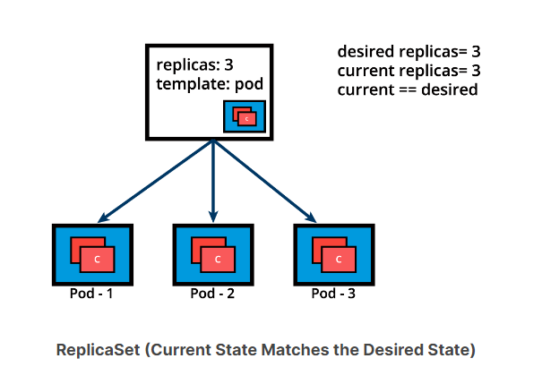
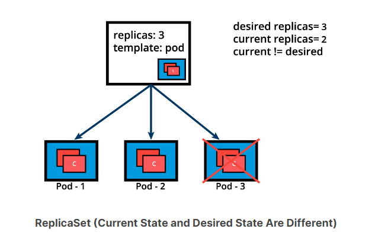
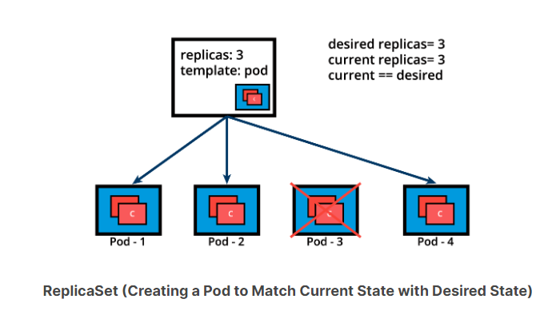

# ReplicationControllers

Mặc dù không còn được khuyến nghị sử dụng, ReplicationController là một operator phức tạp, đảm bảo một số lượng bản
sao (replica) cụ thể của Pod đang chạy tại bất kỳ thời điểm nào, bằng cách liên tục so sánh trạng thái thực tế với trạng
thái mong muốn của ứng dụng được quản lý.  
Nếu có nhiều Pod hơn số lượng mong muốn, ReplicationController ngẫu nhiên loại bỏ số lượng Pod vượt quá, và, nếu có ít
Pods hơn số lượng mong muốn, thì ReplicationController yêu cầu tạo thêm Pod cho
đến khi số lượng thực tế khớp với số lượng mong muốn.  
Nói chung, chúng ta không triển khai Pod độc lập, vì nó sẽ không thể tự khởi động lại nếu bị chấm dứt do lỗi vì Pod
thiếu tính năng tự sửa lỗi (self-healing) mà Kubernetes hứa hẹn.  
Phương pháp được khuyến nghị là sử dụng một số loại operator (bộ điều khiển) để chạy và quản lý Pod.

Ngoài việc sao chép (replication), operator ReplicationController còn hỗ trợ cập nhật ứng dụng.

Tuy nhiên, bộ điều khiển được khuyến nghị mặc định là Deployment, cấu hình nên một bộ điều khiển ReplicaSet để quản lý
vòng đời của Pod ứng dụng.

# ReplicaSets

ReplicaSet là một phần kế thừa từ ReplicationController thế hệ tiếp theo, vì nó thực hiện các chức năng sao chép (
replication) và tự sửa lỗi (self-healing) của ReplicationController.   
ReplicaSet hỗ trợ cả bộ chọn dựa trên phép so sánh bằng (equality-based) và bộ chọn dựa trên tập hợp (set-based), trong
khi ReplicationController chỉ hỗ trợ bộ chọn dựa trên phép so sánh bằng.

Khi chỉ chạy một phiên bản duy nhất của ứng dụng, luôn có nguy cơ ứng dụng đó gặp sự cố bất ngờ, hoặc toàn bộ máy chủ
chứa ứng dụng đó bị lỗi.  
Nếu chỉ dựa vào một phiên bản ứng dụng duy nhất, sự cố như vậy có thể ảnh hưởng xấu đến các ứng
dụng, dịch vụ hoặc máy khách khác.  
Để tránh các sự cố hỏng hóc (failure) tiềm ẩn đó, chúng ta có thể chạy nhiều phiên
bản của ứng dụng song song, do đó đạt được tính khả dụng cao.  
Vòng đời của ứng dụng được xác định bởi Pod sẽ được giám sát bởi một bộ điều khiển (controller) – ReplicaSet.  
ReplicaSet giúp chúng ta mở rộng (scale) số lượng Pod chạy một image container ứng dụng cụ thể. Việc mở rộng có thể được
thực hiện thủ công hoặc bằng cách sử dụng bộ tự động mở rộng (autoscaler).

Bên dưới chúng ta mô tả hình ảnh một ReplicaSet, với số lượng bản sao (replica) được đặt thành 3 cho một khuôn mẫu Pod
cụ thể.  
Pod-1, Pod-2, và Pod-3 giống hệt nhau, chạy cùng một image container ứng dụng, được nhân bản từ cùng một khuôn mẫu
Pod.  
Hiện tại, trạng thái thực tế khớp với trạng thái mong muốn.  
Tuy nhiên, hãy nhớ rằng mặc dù ba bản sao Pod được cho là giống hệt nhau – chạy một thể hiện (instance) của cùng một ứng
dụng, cùng cấu hình, chúng vẫn khác biệt nhau về danh tính – tên Pod, địa chỉ IP, và đối tượng Pod đảm bảo rằng ứng dụng
có thể được đặt riêng lẻ vào bất kỳ nút worker nào của cụm do kết quả của quá trình lên lịch (scheduling).



```yaml
apiVersion: apps/v1
kind: ReplicaSet
metadata:
  name: frontend
  labels:
    app: guestbook
    tier: frontend
spec:
  replicas: 3
  selector:
    matchLabels:
      app: guestbook
  template:
    metadata:
      labels:
        app: guestbook
    spec:
      containers:
        - name: php-redis
          image: gcr.io/google_samples/gb-frontend:v3
```

Hãy cùng tiếp tục với ví dụ ReplicaSet trước đó và giả sử rằng một trong các Pod bị buộc phải chấm dứt bất ngờ (do không
đủ tài nguyên, timeout, node chứa nó gặp sự cố, v.v…), khiến trạng thái thực tế không còn khớp với trạng thái mong muốn.



ReplicaSet sẽ phát hiện ra trạng thái thực tế không còn khớp với trạng thái mong muốn và kích hoạt yêu cầu tạo thêm một
Pod, do đó đảm bảo trạng thái thực tế một lần nữa khớp với trạng thái mong muốn.



ReplicaSet có thể được sử dụng độc lập như bộ điều khiển Pod nhưng chúng chỉ cung cấp một tập hợp các tính năng hạn chế.
Deployments, loại bộ điều khiển được khuyến nghị sử dụng cho việc dàn xếp (orchestration) các Pod, cung cấp một tập hợp
các tính năng bổ sung.  
Deployment quản lý việc tạo, xóa và cập nhật Pod. Deployment sẽ tự động tạo ra một ReplicaSet, sau đó ReplicaSet này mới
tạo ra Pod.  
Chúng ta không cần quản lý ReplicaSet và Pod một cách riêng biệt, Deployment sẽ quản lý chúng thay cho ta.
