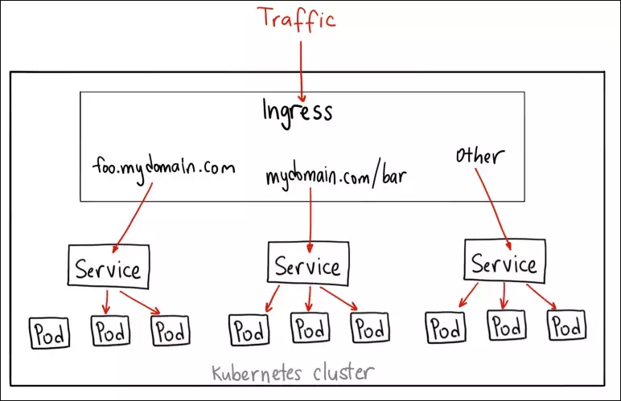

## 🧩 Service trong Kubernetes

Trong Kubernetes (K8s), **Service** là một tài nguyên quan trọng giúp kết nối và điều hướng lưu lượng giữa các **Pod**
trong cluster hoặc từ bên ngoài vào cluster.

Các Pod trong Kubernetes có vòng đời ngắn và có thể được tạo hoặc hủy bất cứ lúc nào, điều này làm cho việc định tuyến
lưu lượng đến Pod trở nên phức tạp. **Service giải quyết vấn đề này bằng cách cung cấp một địa chỉ IP ổn định và tên DNS
**, giúp các Pod giao tiếp với nhau mà không bị gián đoạn khi Pod thay đổi.

🎯 Cơ chế hoạt động của Service

- Service sử dụng selector để xác định Pod mục tiêu (thường dựa trên label).
- Kubernetes sử dụng iptables hoặc IPVS để ánh xạ traffic từ IP Service đến Pod thật.
- Mỗi Service được cấp một ClusterIP (ảo) cố định trong thời gian sống của Service.

### 📌 Các loại Service phổ biến

#### 🔹 ClusterIP (default)

- Tạo IP nội bộ, chỉ truy cập được từ trong cluster.
- Dùng cho giao tiếp nội bộ giữa các Pod/Service.

#### 🔹 NodePort

- Mở một port tĩnh (30000-32767) trên **mọi Node**.
- Cho phép truy cập ứng dụng từ bên ngoài cluster qua `NodeIP:NodePort`.
- Hạn chế: không có cơ chế cân bằng tải thực sự, không bảo mật.
- **Lưu ý**:
    - Cân bằng tải cơ bản qua kube-proxy.
    - Không phù hợp cho production (thiếu TLS termination, advanced routing).

#### 🔹 LoadBalancer

- Tạo ra IP public (external) thông qua **load balancer của Cloud Provider**.
- Tự động phân phối traffic đến các Node → Pod.
- Chỉ dùng được trên môi trường cloud (AWS, GCP, Azure…).

#### 🔹 ExternalName

- Không định tuyến traffic như các loại Service khác.
- Ánh xạ tên DNS (`externalName: example.com`) → truy cập đến **dịch vụ bên ngoài cluster**.

#### 🔹 Headless Service (`ClusterIP: None`)

- Không cấp ClusterIP → client sẽ nhận danh sách IP của Pod thông qua DNS.
- Dùng để load balancing client-side, hoặc cho các hệ thống stateful như Cassandra, Elasticsearch…

---

### 🧪 Ví dụ về ClusterIP Service

```yaml
apiVersion: v1
kind: Service
metadata:
  name: backend-service
spec:
  type: ClusterIP
  selector:
    app: myapp
  ports:
    - protocol: TCP
      port: 80         # Port mà Service lắng nghe
      targetPort: 8080 # Port trong container mà lưu lượng sẽ được chuyển đến
```

📘 **Giải thích:**

- `type`: Chỉ định loại Service là `ClusterIP`.
- `selector`: Dùng để xác định các Pod mà Service sẽ gửi lưu lượng đến (có nhãn `app: myapp`).
- `port`: Cổng mà Service sử dụng để nhận request.
- `targetPort`: Cổng trong container của Pod mà lưu lượng được chuyển đến.

---

## 🌐 Ingress trong Kubernetes

**Ingress** là một tài nguyên trong Kubernetes dùng để định nghĩa các **quy tắc điều hướng lưu lượng HTTP/HTTPS** đến
các Service nội bộ.

Ingress giúp xác định cách chuyển tiếp request dựa trên **tên miền**, **đường dẫn URL**, hoặc các điều kiện khác.

> ⚠️ **Ingress chỉ định nghĩa quy tắc, không xử lý lưu lượng trực tiếp**. Để hoạt động được, cần có **Ingress Controller
** tương ứng.

---

### 🧪 Ví dụ về Ingress:

```yaml
apiVersion: networking.k8s.io/v1
kind: Ingress
metadata:
  name: example-ingress
spec:
  ingressClassName: nginx
  rules:
    - host: example.com
      http:
        paths:
          - path: /
            pathType: Prefix
            backend:
              service:
                name: ui-service
                port:
                  number: 80
          - path: /api
            pathType: Prefix
            backend:
              service:
                name: api-service
                port:
                  number: 80
```

📘 **Giải thích:**

- `ingressClassName`: Xác định Ingress Controller nào sẽ xử lý Ingress này (`nginx`).
- `rules`: Tập hợp các quy tắc điều hướng lưu lượng.
- `host`: Tên miền (ví dụ: `example.com`) mà Ingress sẽ xử lý.
- `paths`: Danh sách các đường dẫn URL và các Service tương ứng sẽ xử lý các request đó.

---

## ⚙️ Ingress Controller & NGINX Ingress Controller

### 🔸 Ingress Controller

Ingress Controller là một thành phần hoạt động như **Proxy hoặc Load Balancer**, giúp hiện thực hóa các quy tắc được
khai báo trong các tài nguyên Ingress.

Không có sẵn mặc định trong Kubernetes – bạn cần cài đặt thêm. Có nhiều loại, ví dụ:

- **NGINX Ingress Controller**
- **HAProxy**
- **Istio (Gateway + VirtualService)**

### 🔸 NGINX Ingress Controller

Là một **implementation phổ biến** của Ingress Controller, dựa trên NGINX.

- Chạy như một Pod trong cluster
- Theo dõi tài nguyên Ingress và cấu hình lại NGINX tương ứng
- Định tuyến lưu lượng từ bên ngoài vào đúng Service nội bộ theo các quy tắc đã định

---

### 🧪 Ví dụ về triển khai NGINX Ingress Controller

```yaml
apiVersion: apps/v1
kind: Deployment
metadata:
  name: nginx-ingress-controller
spec:
  replicas: 2
  selector:
    matchLabels:
      app: nginx-ingress
  template:
    metadata:
      labels:
        app: nginx-ingress
    spec:
      serviceAccountName: nginx-ingress-serviceaccount
      containers:
        - name: nginx-ingress-controller
          image: k8s.gcr.io/ingress-nginx/controller:v1.0.0
          args:
            - /nginx-ingress-controller
            - --ingress-class=nginx
            - --configmap=$(POD_NAMESPACE)/nginx-configuration
          env:
            - name: POD_NAMESPACE
              valueFrom:
                fieldRef:
                  fieldPath: metadata.namespace
            - name: POD_NAME
              valueFrom:
                fieldRef:
                  fieldPath: metadata.name
          ports:
            - name: http
              containerPort: 80
            - name: https
              containerPort: 443
```

📘 **Giải thích:**

- `serviceAccountName`: Cho phép NGINX Ingress Controller tương tác với tài nguyên trong cluster.
- `args`: Thiết lập Ingress Class, ConfigMap,...
- `env`: Thiết lập các biến môi trường cần thiết cho NGINX.
- `ports`: Khai báo cổng HTTP và HTTPS mà Controller sẽ lắng nghe.

---

## 🧭 4. Mapping giữa Service và Ingress

| Use case                       | Nên dùng gì?                 |
|--------------------------------|------------------------------|
| Nội bộ Pod → Pod               | ClusterIP                    |
| Truy cập từ ngoài (test dev)   | NodePort                     |
| Truy cập từ ngoài (cloud prod) | LoadBalancer                 |
| Routing HTTP/HTTPS theo domain | Ingress + Ingress Controller |
| Routing đến service bên ngoài  | ExternalName                 |

---

## 📌 Tổng kết

| Thành phần             | Vai trò                                           |
|------------------------|---------------------------------------------------|
| **Service**            | Định tuyến ổn định đến Pod                        |
| **Ingress**            | Quy tắc điều hướng HTTP/HTTPS từ ngoài vào        |
| **Ingress Controller** | Thực thi quy tắc Ingress bằng cách cấu hình proxy |


